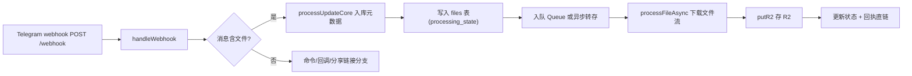
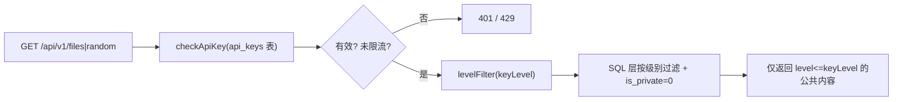

# 架构说明

## 1. 系统总览

一个单体 Cloudflare Worker(`worker.js` 为 `wrangler.toml` 的 `main`),职责:

- **文件转存**:接收 Telegram 消息,下载文件到 R2,元数据写 D1,回执永久直链
- **对外服务**:公开分级 JSON API、轮播展示页 `/show`、文件直链代理 `/file/tg/<id>`
- **管理能力**:`/admin`(静态页)+ `/admin/api/*`(REST)+ 旧式 `/api/*`(兼容)
- **后台任务**:Queue 消费、Cron 兜底轮询/自愈/备份、webhook 自愈

依赖的 Cloudflare 资源:

| 资源 | 绑定名 | 用途 |
|---|---|---|
| R2 存储桶 `bot-telegram` | `R2_BUCKET` | 文件本体、`admin.html`、`backups/db-*.json` 备份 |
| D1 数据库 `telegram-url` | `D1_DB` | 元数据、设置、API 密钥、限流计数、worker 统计 |
| Cron 触发器 | — | `*/2 * * * *`(轮询兜底)、`0 1 * * *`(日报) |
| Cloudflare Queues | — | 大文件/分享链接的后台转存(最长 15 分钟执行) |

## 2. 运行环境与入口

`worker.js` 导出三个回调(见 `worker.js:29-272`):

- `fetch(request, env, ctx)` — 一切 HTTP 请求的入口,按 `method + pathname` 分发
- `queue(batch, env)` — Queue 消息消费者,转交 `handleQueueMessage`(`worker.js:274`)
- `scheduled(event, env, ctx)` — Cron 触发,执行日报、webhook 自愈、轮询兜底、未转存重试、查重、存储维护、WebP 压缩、内置命令同步、节目组定时换图

每个请求开头都会:

1. 处理 `OPTIONS` 预检(统一 CORS)
2. `ensureTablesOnce(env.D1_DB)` 幂等建表(每个 isolate 仅一次,避免冷启动 D1 开销)
3. `bumpWorkerStat(env)` 本地请求计数兜底统计

## 3. 模块划分

### 3.1 主文件 `worker.js`(约 4800 行)

函数按功能区组织(行号见 `worker.js:1-4839`):

| 区域 | 代表函数 | 说明 |
|---|---|---|
| 工具与常量 | `cnShift/cnTodayStr/cnDayIso` | 东八区日期计算 |
| 内容分级 | `LEVEL_RANK/LEVEL_ORDER/sanitizeLevel/levelFilter` | 级别校验与 SQL 层过滤 |
| 消息与菜单 | `handleBotCommand/replyCommandMenu/parseMenu/menuButtons` | Bot 命令与数字菜单交互 |
| Webhook | `handleWebhook/processUpdateCore/handleCallbackQuery` | Telegram webhook 与回调查询 |
| 文件处理 | `processFileAsync/dlFile*/putR2*/stripExifIfJpeg` | 下载→存储→入库全链路 |
| 分享链接 | `isShareLink/extractShareLink/processShareLinkAsync` | 解析第三方分享链接转存 |
| 公开 API | `handlePublicFiles/handlePublicRandom/checkApiKey` | v1 分级 API |
| 旧式 API | `handleFiles/handleStats/handleByChat/...` | 兼容旧 `/api/*` |
| 管理 API | `handleAdmin*/handlePool*/handleShow*` | `/admin/api/*` 全量接口 |
| 代理与后台 | `proxyBotApi/handlePollUpdates/retryUnsavedCron/...` | Bot API 代理与定时任务 |

### 3.2 `src/` 辅助模块

| 文件 | 内容 | 引用方 |
|---|---|---|
| `src/db.js` | D1 建表 + 列迁移(`ensureTablesOnce/ensureTables`) | worker 每次请求 |
| `src/util.js` | 纯函数:`json/cors/fmtSize/genHash` 等 | 各模块 |
| `src/notify.js` | 转存失败告警(5 分钟节流)+ `genThumb` WebP 缩略图 | 转存失败时 |
| `src/ratelimit.js` | D1 分钟窗口计数限流 `applyRateLimit` | 公开 API |
| `src/backup.js` | `dumpAllTables` 全表 JSON 备份,保留最近 20 份 | 管理后台备份 |

### 3.3 `admin.html`(约 3700 行)

纯静态管理后台,由部署流水线上传到 R2(`bot-telegram/admin.html`),`GET /admin` 返回该文件。含 15 个功能 tab(见 [模块/admin-dashboard](./模块/admin-dashboard.md))。

### 3.4 废弃实验版代码

`index.js` + `handlers/` + `services/` + `utils/` 是早期实验版(README 仍引用该结构),`wrangler.toml` 的 `main` 已指向 `worker.js`,**这些目录不被任何部署引用**,可视为历史存档。判断依据:`wrangler.toml:8` `main = "worker.js"`。

## 4. 数据模型(D1)

核心表(完整 DDL 见 `src/db.js:16-36`):

| 表 | 用途 | 关键列 |
|---|---|---|
| `files` | 入库文件元数据 | `storage_key/r2_url/chat_*/user_*/telegram_file_id/file_*/processing_state/md5_hash/quick_hash/tags/pool_status/group_ref/level/is_private/deleted_at` |
| `random_pool` | 共享随机轮播库 | `url/thumb_url/title/tags/level/is_private/enabled/source` |
| `api_keys` | 第三方 API 密钥 | `key/name/scopes/level/enabled/expires_at/last_used_at/usage_count` |
| `show_groups` | 轮播节目组(定时换图) | `name/images/mode/daily_count/updated_at` |
| `bot_commands` | 自定义 Bot 命令 | `command/response/description/menu/builtin/enabled` |
| `settings` | KV 设置(proxy-mode、配额、通知等) | `key/value` |
| `rate_limits` | 分钟级限流计数 | `key/window/count`,UNIQUE(key,window) |
| `worker_stats` | 本地请求统计兜底 | `day/requests/errors` |

列迁移策略:新列同时进 `CREATE TABLE`(新库)与 `PRAGMA table_info` 检查后 `ALTER`(旧库),迁移失败会抛错让下一请求重试(`src/db.js:38-123`)。

## 5. 存储结构(R2)

```
bot-telegram/
├── 2026/08/            # 按月分目录的文件本体(storage_key)
├── admin.html          # 管理后台静态页
├── backups/db-*.json   # D1 全表备份(自动保留最近 20 份)
└── thumbs/             # WebP 缩略图(压缩任务产物)
```

R2 开启 `smart_tiered_cache = true`(`wrangler.toml:21`),热数据 CDN 缓存、冷数据按需回源。

## 6. 核心数据流

### 6.1 文件入库(webhook 路径)



### 6.2 公开 API(分级过滤)



### 6.3 文件直链代理

`GET /file/tg/<id>` → 查 `files.tg_file_url` → 302 跳转 Telegram 官方直链(proxy-mode 下由 worker 实时流式拉取,见 [专有概念/文件转存流程](./专有概念/文件转存流程.md))。

## 7. 调度任务(Cron)

`wrangler.toml:32` 注册 `*/2 * * * *` 与 `0 1 * * *`:

| 任务 | 触发 | 行为 |
|---|---|---|
| 日报推送 | `0 1 * * *`(北京 09:00) | `sendDailyReport` 推送昨日汇总 |
| webhook 自愈 | 每 5 分钟 | `ensureWebhook` 确认 webhook 存活,丢失自动恢复 |
| 轮询兜底 | 每 2 分钟 | `handlePollUpdates` 用 Local Bot API 拉 `getUpdates` |
| 未转存重试 | 每 5 分钟 | `retryUnsavedCron` 重试若干条未完成记录 |
| 查重后台化 | 每 5 分钟 | `runDedupBatch` 计算 3 个缺失 MD5 |
| 存储维护 | 24 小时一次 | 回收站超期文件硬清(含 R2 对象) |
| WebP 压缩 | 每 5 分钟 | `compressCronBatch` 自动压 2 张 |
| 内置命令同步 | 每次调度 | `syncBuiltinCommands` 登记内置命令(INSERT OR IGNORE) |
| 节目组换图 | 每次调度 | `rotateProgramImages` 按 mode/roll_time 轮换节目组图片 |

## 8. 部署架构

push `main` → GitHub Actions(`.github/workflows/deploy-worker.yml`):

1. `node --check worker.js` 及 `src/*.js` 语法检查
2. `wrangler deploy` 部署 Worker
3. `wrangler secret put` 写入 `TG_BOT_TOKEN`/`API_KEY`/`CF_API_TOKEN`
4. 二次 `wrangler deploy`(让机密随最新版本上线)
5. `bump-version.js` 注入 `APP_VERSION = v1.0.<run#>`
6. `wrangler r2 object put` 上传 `admin.html` 到 R2

详细步骤见 [DEVELOPER_GUIDE.md](./DEVELOPER_GUIDE.md) 与 [模块/部署流水线](./模块/部署流水线.md)。
