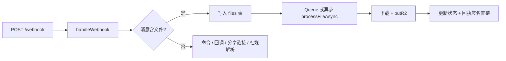
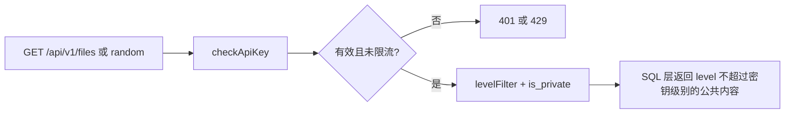

# 架构说明

## 1. 系统总览

单体 Cloudflare Worker（`wrangler.toml` 的 `main = "worker.js"`），职责：

- **文件转存**：接收 Telegram 消息，下载文件到 R2 或走代理直链，元数据写 D1（可选镜像 MySQL），回执签名直链
- **对外服务**：公开分级 JSON API、轮播 `/show`、画廊 `/gallery`、用户门户 `/user`、文件代理 `/file/tg/<token>/<id>.<ext>`
- **管理能力**：`/admin`（R2 静态页）+ `/admin/api/*` + 旧式 `/api/*`
- **后台任务**：Queue 消费、Cron 轮询/自愈/备份/压缩、webhook 自愈
- **客户端**：Flutter PicWall；网页抓取走独立 Python relay

依赖的 Cloudflare 资源：

| 资源 | 绑定名 | 用途 |
|---|---|---|
| R2 桶 `bot-telegram` | `R2_BUCKET` | 文件本体、静态页、`backups/db-*.json`、`thumbs/` |
| D1 库 `telegram-url` | `D1_DB` | 元数据、设置、密钥、限流、统计 |
| Hyperdrive | `telequnphoto` | 直连 VPS MySQL，D1 故障/限额时的备库 |
| Cron | — | `*/2 * * * *`（轮询兜底）、`0 1 * * *`（日报） |
| Cloudflare Queues | — | 大文件/分享链接后台转存（最长 15 分钟） |

Worker 付费版限制见 `wrangler.toml`：`memory_mb = 256`、`cpu_ms = 30000`。`compatibility_date = "2026-08-31"` 启用完整 nodejs_compat（mysql2 可用）。

## 2. 运行环境与入口

`worker.js` 导出三个回调（约 40–519 行）：

- `fetch(request, env, ctx)` — HTTP 入口，按 `method + pathname` 分发
- `queue(batch, env)` — Queue 消费者，转交 `handleQueueMessage`（分享链接或 `processFileAsync`）
- `scheduled(event, env, ctx)` — Cron：日报、webhook 自愈、轮询、未转存重试、查重、存储维护、WebP 压缩、内置命令同步、节目组换图

每个请求开头：

1. `OPTIONS` 预检（统一 CORS）
2. `ensureTablesOnce(env.D1_DB)` 幂等建表（isolate 内只跑一次；`SCHEMA_VERSION = '14'` 命中则跳过迁移）
3. `bumpWorkerStat(env)` 本地请求计数兜底

`fetch` 外层 try/catch 把未捕获异常转成 JSON 500，避免 Cloudflare 返回 HTML 错误页。

## 3. 模块划分

### 3.1 主文件 `worker.js`（约 930 行）

业务 handler 已拆到 `src/`。`worker.js` 只做 import、路由表、queue/scheduled。路由顺序见 [模块/worker-main](./模块/worker-main.md)。

### 3.2 `src/` 辅助模块

| 文件 | 职责 |
|---|---|
| `core.js` | 东八区时间、`LEVEL_RANK` / `levelFilter`、密钥生成 |
| `db.js` | D1 建表 + 列迁移，`SCHEMA_VERSION = '14'` |
| `util.js` | `json/cors/fmtSize/genHash`、内存 cache |
| `ratelimit.js` | API Key / IP / 管理员 / 用户门户限流；`hasScope` / `hasLevel` |
| `notify.js` | 失败告警 + WebP 缩略图 |
| `backup.js` | D1 全表 JSON 备份，R2 保留最近 20 份 |
| `telegram.js` | Bot API、文件下载、R2 写入、签名 token |
| `api.js` | `/file/tg` 代理、懒转存、Range/206、旧式文件列表 |
| `webhook.js` | webhook、轮询、`processFileAsync`、分享链接 |
| `commands.js` | Bot 命令、AI、用量查询 |
| `public.js` | 公开 API、密钥/兑换码、共享库、抓取、用户上传 |
| `admin.js` | 未转存/去重/压缩/Cron 日报 |
| `events.js` | 事件 webhook、回收站、R2 检视、多 Bot |
| `pages.js` | 从 R2 读静态页 |
| `batch.js` | `group_ref` 分配与批量回执 |
| `parser.js` | cobalt 解析 Instagram/X/YouTube/TikTok |
| `mysql.js` / `dbaccess.js` / `migrate.js` | Hyperdrive MySQL 与 D1 双写/降级 |
| `app_stats.js` | PicWall 安装/心跳/更新源 |

详见 [模块/src-modules](./模块/src-modules.md)。

### 3.3 静态页（上传到 R2）

`admin.html`、`admin-guide.html`、`user.html`、`user-manage.html`、`jx.html`、`scrape.html`。`GET /admin` 等从 R2 读取。流水线同时上传 `*.html` 与无扩展名 key，兼容历史 URL。

### 3.4 废弃实验版

`index.js` + `handlers/` + `services/` + `utils/` 不被 `wrangler.toml` 引用。

### 3.5 客户端与中转

- `android/picwall_app`：Flutter PicWall，默认 API `https://telegram-r2-bot.wo58.cn`
- `relay/`：Python aiohttp，下载图片再 `sendPhoto`/`sendDocument` 到 Telegram，避开 Worker 内存上限

## 4. 数据模型（D1）

`SCHEMA_VERSION = '14'`。完整 DDL 见 `src/db.js`。

| 表 | 用途 | 关键列 |
|---|---|---|
| `files` | 入库文件 | `storage_key/r2_url/telegram_file_id/processing_state/md5_hash/tags/pool_status/group_ref/level/is_private/deleted_at/original_url` |
| `random_pool` | 共享/私密轮播库 | `url/thumb_url/title/tags/level/is_private/enabled/source` |
| `api_keys` | 第三方密钥 | `key/name/scopes/level/enabled/expires_at/key_pass/username` |
| `redeem_codes` | 兑换码 | `code/level/quota/type/extend_days` |
| `show_groups` | 轮播节目组 | `name/images/mode/daily_count` |
| `bot_commands` | 自定义命令 | `command/response/menu/builtin/enabled` |
| `settings` | KV 设置 | `key/value`（含 `schema_version`） |
| `rate_limits` | 分钟窗口计数 | UNIQUE(`key`,`window`) |
| `worker_stats` | 请求计数兜底 | `day/requests/errors` |
| `user_stats` / `known_chats` | Bot 交互统计 | — |
| `api_call_logs` | 公开 API 调用日志 | `key_id/path/status` |
| `tags` / `folders` | 标签与共享库文件夹 | — |
| `user_uploads` | 用户门户上传 | `user_id/url/deleted_at` |
| `app_installs` | PicWall 安装/心跳 | `device_id/app_version` |

列迁移：新列同时进 `CREATE TABLE` 与 `PRAGMA table_info` 后 `ALTER`。`original_url` 有条件唯一索引，防止抓取并发重复入库。

## 5. 存储结构（R2）

```
bot-telegram/
├── 2026/08/              # 按月分目录的文件本体
├── admin.html / admin /  # 管理后台（有扩展名 + 裸 key）
├── user.html / user / jx.html / scrape.html / ...
├── backups/db-*.json
└── thumbs/               # WebP 缩略图
```

热数据走 CDN；冷数据按需回源。`smart_tiered_cache` 需在 R2 Dashboard 开，`wrangler.toml` 不写该字段。

## 6. 核心数据流

### 6.1 文件入库（webhook）


```mermaid
flowchart LR
    A["POST /webhook"] --> B["handleWebhook"]
    B --> C{"消息含文件?"}
    C -->|是| D["写入 files 表"]
    D --> E["Queue 或异步 processFileAsync"]
    E --> F["下载 + putR2"]
    F --> G["更新状态 + 回执签名直链"]
    C -->|否| H["命令 / 回调 / 分享链接 / 社媒解析"]
```

### 6.2 公开 API


```mermaid
flowchart LR
    A["GET /api/v1/files 或 random"] --> B["checkApiKey"]
    B --> C{"有效且未限流?"}
    C -->|否| D["401 或 429"]
    C -->|是| E["levelFilter + is_private"]
    E --> F["SQL 层返回 level 不超过密钥级别的公共内容"]
```

### 6.3 文件直链

`GET /file/tg/<token>/<id>.<ext>` → 校验 `fileTok` → 有真实 R2 URL 则 302；否则代理 Telegram 并透传 Range。带 Range 的请求也会触发懒转存。详见 [专有概念/签名直链与代理](./专有概念/签名直链与代理.md)。

## 7. 调度任务（Cron）

`wrangler.toml` 注册 `*/2 * * * *` 与 `0 1 * * *`。`scheduled` 里 webhook 自愈、轮询、重试、查重、压缩每次都会跑；日报只在 `0 1 * * *`。注释写「每 5 分钟」的任务实际跟着 `*/2` cron 触发，间隔以代码调用为准。

| 任务 | 触发 | 行为 |
|---|---|---|
| 日报 | `0 1 * * *`（北京 09:00） | `sendDailyReport` |
| webhook 自愈 | 每次 scheduled | `ensureWebhook` |
| 轮询兜底 | 每次 scheduled | `handlePollUpdates` |
| 未转存重试 | 每次 scheduled | `retryUnsavedCron` |
| 查重 | 每次 scheduled | `runDedupBatch` 算 3 个缺失 MD5 |
| 存储维护 | 每次 scheduled（函数内 24h 节流） | 回收站超期硬清 |
| WebP 压缩 | 每次 scheduled | `compressCronBatch` 压 2 张 |
| 内置命令同步 | 每次 scheduled | `syncBuiltinCommands` INSERT OR IGNORE |
| 节目组换图 | 每次 scheduled | `rotateProgramImages` |

## 8. 部署架构

push `main` 且路径不只是 `android/**` → `.github/workflows/deploy-worker.yml`：

1. `node --check worker.js` 及 `src/*.js`
2. `npm ci`（mysql2）
3. `cloudflare/wrangler-action@v4` + wrangler `4.128.0` 部署
4. `wrangler secret put` 写入 `TG_BOT_TOKEN` / `API_KEY` / `CF_API_TOKEN` / `RELAY_URL` / `RELAY_KEY`
5. 二次 `wrangler deploy`
6. `bump-version.js` 注入 `APP_VERSION = v1.0.<run#>`
7. 上传 `admin.html` 等静态页到 R2（必须 `--remote`）

`android/picwall_app/**` 走 `build-android.yml`：`flutter analyze` + `flutter test` + 固定 keystore 重签 APK。

详见 [DEVELOPER_GUIDE.md](./DEVELOPER_GUIDE.md) 与 [模块/部署流水线](./模块/部署流水线.md)。
