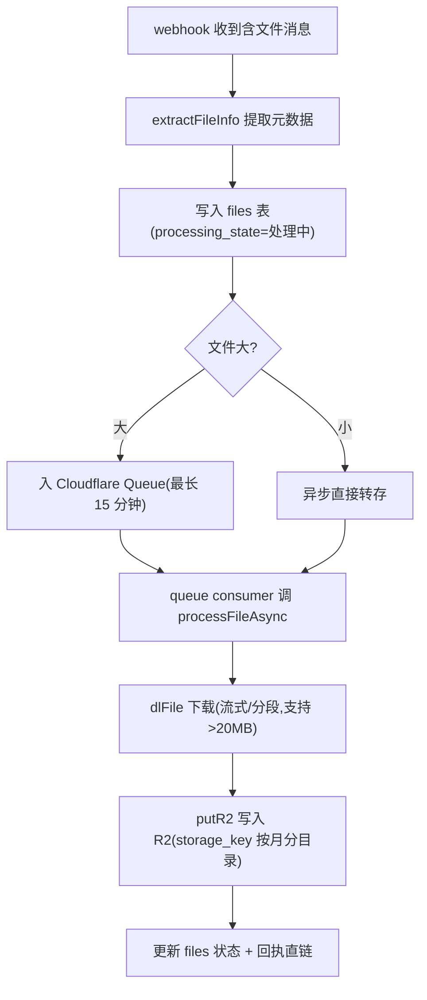

# 文件转存流程

描述一条 Telegram 消息从到达 webhook 到回执永久直链的完整链路。

## 1. 消息入口

`POST /webhook` → `handleWebhook`(webhook 模式)或 Cron 轮询 `handlePollUpdates`(Local Bot API 兜底,`/bot/getUpdates`)。

`processUpdateCore` 先判断消息类型:

- 含文件 → 走文件转存流程
- 文本命令(`/xxx`)→ `handleBotCommand`
- 分享链接 → `processShareLinkAsync`(解析第三方分享链接,入队转存)
- 回调查询 → `handleCallbackQuery`

## 2. 文件转存主链路

关键函数:

- `extractFileInfo(msg)`(`worker.js:1993`):从消息提取 `fileId/fileSize/fileType/...`
- `dlFile / dlFileLarger`(`worker.js:2139`):优先 Telegram 官方 CDN,大文件分段下载并带进度回调
- `putR2 / putR2Stream`(`worker.js:2172`):写入 R2,可指定 storage class
- `stripExifIfJpeg`(`worker.js:2203`):JPEG 去除 EXIF(隐私 + 体积)
- `replyMsg`(`worker.js:2242`):回执永久直链给聊天

## 3. 进度与状态

`files` 表通过 `processing_state`(pending/processing/completed/error)、`progress_bytes`、`total_bytes`、`error_msg`、`tg_file_url` 记录转存进度。后台「未转存」tab(`/admin/api/unsaved`)列出已入库但未完成的记录,支持批量重试(`/admin/api/unsaved/retry`)。Cron 每 5 分钟自动重试若干条(`retryUnsavedCron`)。

## 4. 群资源编号(group_ref)

每条入库消息分配唯一编号(批次-序号,如 `440-001`):

- 批内第 1 条以「下一条预计 id」为批次基准,之后批内递增
- 距上一条消息超过 5 分钟视为新批次(`TG_REF_GAP_MS = 300 * 1000`,`worker.js:292`)
- 编号同时写入 Bot 回复与后台,用户批量转发后可对照回复发现缺失

## 5. 代理模式(省存储)

`settings.proxy-mode=1` 时:

- 文件**不入 R2**,仅入库元数据
- 直链 `/file/tg/<id>` 由 Worker 实时从 Telegram 拉取(`tg_file_url`)后返回
- 适用:telegram 文件过大、想省 R2 存储成本;代价是每次访问都依赖 Telegram 可用性

`proxy-only` 进一步限定全部文件走代理。通过 `/admin/api/settings/proxy-mode`、`/admin/api/settings/proxy-only` 配置。

## 6. 分享链接转存

识别并解析第三方分享链接(`isShareLink/extractShareLink`,`worker.js:1447`):

- 提取链接 → 解析出视频/资源地址 → 入队 `processShareLinkAsync`
- 与文件转存共用 Queue 与 files 表,同样走「先入库、后台转存」策略

## 7. 失败与告警

- 转存失败时 `processing_state='error'` + `error_msg` 记录原因
- `src/notify.js` 向配置的管理员 chat 发送失败告警,同一错误 5 分钟内节流去重
- 失败记录可被后台批量重试或 Cron 自动重试

## 8. 下载实现细节

- Telegram 文件下载优先官方 CDN;Base URL 可配置(`tgApiBases`)以兼容 Local Bot API 域名
- 大文件用 `readBodyWithProgress` 流式累积并回调进度,避免一次性占满内存
- 文件校验:入库时计算 `md5_hash` / `quick_hash`,供查重(`/admin/api/dedup/*`)使用
