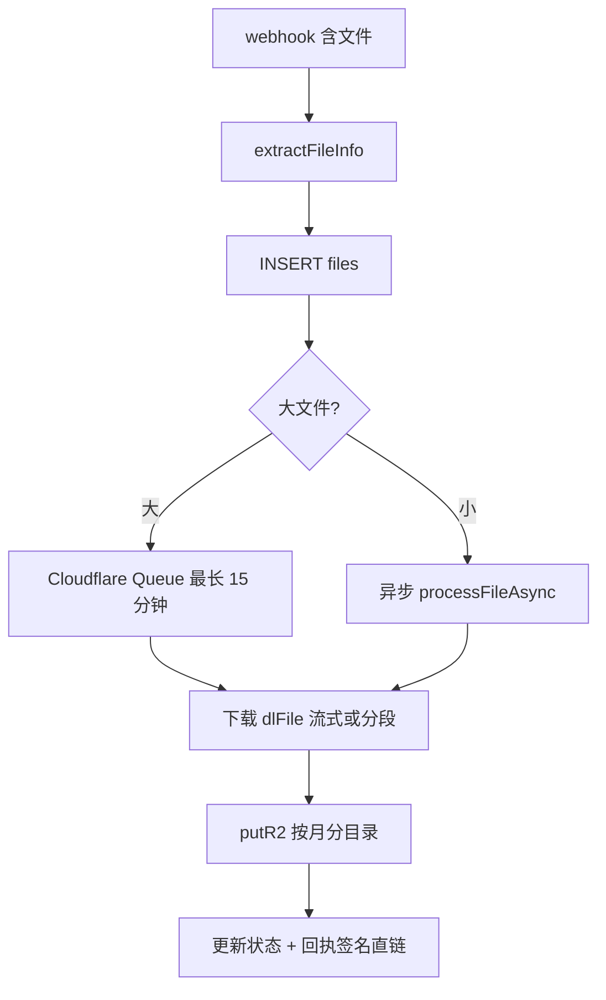

# 文件转存流程

Telegram 消息从 webhook 到回执签名直链。

## 1. 入口

`POST /webhook` → `handleWebhook`（`src/webhook.js`）。Cron `handlePollUpdates` 作 Local Bot API 兜底。

`processUpdateCore` 分支：含文件 → 转存；`/命令` → `handleBotCommand`；分享链接 → `processShareLinkAsync`；社媒链接 → `parser.js` cobalt；回调查询 → `handleCallbackQuery`；用户删消息 → `handleDeletedMsg`。群消息里一行一个图片 URL 会自动抓取。

## 2. 主链路

```mermaid
flowchart TD
    A["webhook 含文件"] --> B["extractFileInfo"]
    B --> C["INSERT files"]
    C --> D{"大文件?"}
    D -->|大| E["Cloudflare Queue 最长 15 分钟"]
    D -->|小| F["异步 processFileAsync"]
    E --> G["下载 dlFile 流式或分段"]
    F --> G
    G --> H["putR2 按月分目录"]
    H --> I["更新状态 + 回执签名直链"]
```

关键实现已不在 `worker.js` 大文件里：下载/写入在 `src/telegram.js`，异步处理在 `src/webhook.js`，Queue 分发在 `worker.js:521`。

`dbId` 为空（INSERT 失败）时 Queue 直接跳过，避免幽灵转存。写入 D1 同时可 `dualInsertFiles` 镜像 MySQL。

## 3. 状态

`processing_state`：pending / processing / completed / error。配 `progress_bytes`、`total_bytes`、`error_msg`、`tg_file_url`。后台「未转存」+ Cron `retryUnsavedCron`。

## 4. 群资源编号

见 [群资源编号](./群资源编号.md)。写入 `files.group_ref` 与 Bot 回执。

## 5. 代理模式

`settings.proxy-mode=1`：不入 R2，`/file/tg/` 实时拉 Telegram。`proxy-only` 全部走代理。访问时 ranged 请求也会 `scheduleLazyTransfer`，首次观看后落到 R2，后续 302。详见 [签名直链与代理](./签名直链与代理.md)。

## 6. 分享链接与社媒

第三方分享走 Queue `processShareLinkAsync`。Instagram / X / YouTube / TikTok 走 cobalt（`src/parser.js`）。

## 7. 失败

`processing_state='error'` + `notifyAdmin` 5 分钟节流。可手动或 Cron 重试。

## 8. 下载细节

优先官方 CDN；`tgApiBases` 兼容 Local Bot API。大文件 `readBodyWithProgress`。入库算 `md5_hash` / `quick_hash` 供查重。JPEG `stripExifIfJpeg`。
