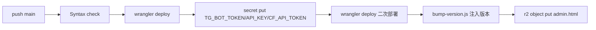

# 部署流水线

`.github/workflows/deploy-worker.yml`:push `main` 即自动部署 Worker 并上传管理后台到 R2。

## 触发

`on.push.branches: [main]`。仅 main 分支触发。

## 步骤



1. **Syntax check**:`node --check worker.js` + 遍历 `src/*.js`
2. **Deploy**:`cloudflare/wrangler-action@v3` 执行 `wrangler deploy`
3. **Set secrets**:顺序 `secret put` 三个密钥(先 deploy 后 put,规避 Cloudflare 版本管理限制);`CF_API_TOKEN` 未配时复用 `CLOUDFLARE_API_TOKEN`
4. **Redeploy with secrets**:secrets 写入后再次 deploy,确保机密随最新版本上线
5. **Bump version**:`node .github/scripts/bump-version.js`(`GITHUB_RUN_NUMBER` → `APP_VERSION`)
6. **Upload admin**:`wrangler r2 object put bot-telegram/admin.html --content-type text/html --cache-control "public, max-age=300"`

## 所需 GitHub Secrets

| Secret | 权限 | 说明 |
|---|---|---|
| `CLOUDFLARE_API_TOKEN` | Worker/D1/R2 编辑 + Account Settings:Read | 部署主体 |
| `CLOUDFLARE_ACCOUNT_ID` | — | 账号 ID |
| `TG_BOT_TOKEN` | — | 写入 Worker secret |
| `API_KEY` | — | 管理员 Key,写入 secret |
| `CF_API_TOKEN`(可选) | R2 Read | R2 官方用量;缺省复用部署 token |
| `TG_SECRET`(暂未用) | — | webhook secret_token,当前不自动部署 |

## 本地手动部署(等价流程)

```bash
npx wrangler deploy
echo "$TG_BOT_TOKEN" | npx wrangler secret put TG_BOT_TOKEN
echo "$API_KEY" | npx wrangler secret put API_KEY
npx wrangler deploy
node .github/scripts/bump-version.js
npx wrangler r2 object put bot-telegram/admin.html --file=admin.html --content-type text/html --cache-control "public, max-age=300"
```

注意:`TG_BOT_TOKEN`/`API_KEY`/`TG_SECRET` 属机密,不写入 `wrangler.toml`;`wrangler deploy` 不会删除 Dashboard 已有 secrets。

## 相关文件

- `deploy.sh`:早期本地部署脚本(历史,当前以 GitHub Actions 为准)
- `DEPLOY.md`:部署说明(历史)
- `R2_LIFECYCLE_GUIDE.md`:R2 生命周期策略说明
