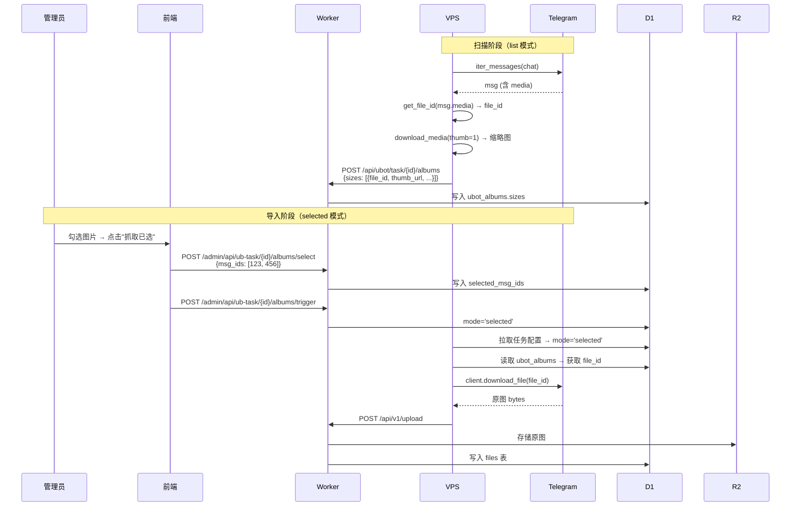

# 群抓取图片地址持久化 - 技术设计

Feature Name: group-scan-file-id-persistence
Updated: 2026-09-01

## Description

在群抓取相册扫描阶段，将 Telegram file_id 存入 D1 数据库，使导入阶段可直接用 file_id 下载原图，避免重复扫描群消息。

## Architecture



## Components and Interfaces

### 1. VPS 扫描阶段 (userbot_pull.py)

**修改函数**: `run_list_albums`

当前流程:
```
msg → 提取 size/w/h → download_media(thumb=1) → upload_cover
```

修改后流程:
```
msg → get_file_id(msg.media) → 提取 size/w/h → download_media(thumb=1) → upload_cover
```

关键代码变更:
```python
from telethon.utils import get_file_id

# 在提取 size 信息时，同时获取 file_id
fid = ''
try:
    fid = get_file_id(msg.media) or ''
except Exception:
    fid = ''

# 存入 sizes
a["sizes"].append({
    "id": msg.id,
    "size": sz,
    "w": w,
    "h": h,
    "type": media_type,
    "duration": dur,
    "thumb_url": thumbs.get(str(msg.id), ""),
    "file_id": fid  # 新增
})
```

### 2. VPS 导入阶段 (userbot_pull.py)

**修改函数**: `run_selected_pull`

当前流程:
```
client.get_messages(chat, ids=chunk) → msg.download_media(file=bytes) → upload_media
```

修改后流程:
```
读取 ubot_albums 获取 file_id → client.download_file(file_id) → upload_media
```

关键代码变更:
```python
# 新增：批量读取选中消息的 file_id
file_id_map = {}  # {msg_id: file_id}
# 从 D1 读取 ubot_albums 中对应 msg_id 的 file_id
# (通过 worker API 获取)

for msg_id in selected_ids:
    fid = file_id_map.get(str(msg_id), '')
    if fid:
        # 优先用 file_id 下载
        result = await client.download_file(fid, file=bytes)
        data = result
    else:
        # 回退到原有方式
        msgs = await client.get_messages(chat, ids=msg_id)
        if msgs and msgs[0]:
            data = await msgs[0].download_media(file=bytes)
```

### 3. Worker API (userbot.js)

**修改函数**: `handleAdminUbotAlbumsGet`

在返回的 sizes 数组中包含 `file_id` 字段:
```javascript
sizes: sizes.map(function(s) {
    return {
        id: Number(s.id) || 0,
        size: Number(s.size) || 0,
        w: Number(s.w) || 0,
        h: Number(s.h) || 0,
        thumb_url: s.thumb_url || '',
        sel: selected.has(String(s.id)),
        type: s.type || 'photo',
        duration: Number(s.duration) || 0,
        file_id: s.file_id || ''  // 新增
    };
})
```

**修改函数**: `handleAdminUbotAlbumsSelect`

在保存 selected_msg_ids 时，同时存储对应的 file_id 映射:
```javascript
// 新增：存储选中消息的 file_id 映射
const fileIdMap = {};
const allAlbums = await env.D1_DB.prepare(
    'SELECT sizes FROM ubot_albums WHERE task_id=?'
).bind(id).all();
(allAlbums.results || []).forEach(function(a) {
    try {
        JSON.parse(a.sizes || '[]').forEach(function(s) {
            if (selected.has(String(s.id)) && s.file_id) {
                fileIdMap[s.id] = s.file_id;
            }
        });
    } catch(e) {}
});
// 存入 userbot_tasks.selected_file_ids 字段
```

**新增函数**: `handleAdminUbotTaskFileIdMap`

供 VPS 在 selected 模式下查询选中消息的 file_id:
```
GET /admin/api/ub-task/{id}/file-id-map?token=xxx
→ { ok: true, data: { "123": "AgACAgIAAxkBAAI...", "456": "AgACAgIAAxkBAAI..." } }
```

### 4. 数据库变更

**无需新增表或列**。file_id 存储在 `ubot_albums.sizes` JSON 的每个元素中。

现有 sizes 结构:
```json
[{"id": 123, "size": 123456, "w": 800, "h": 600, "type": "photo", "duration": 0, "thumb_url": "..."}]
```

修改后:
```json
[{"id": 123, "size": 123456, "w": 800, "h": 600, "type": "photo", "duration": 0, "thumb_url": "...", "file_id": "AgACAgIAAxkBAAI..."}]
```

### 5. 前端变更 (admin.html)

**修改函数**: `ubotAlbumsTrigger`（触发导入）

导入开始后显示进度条，轮询任务状态:
```javascript
function ubotAlbumsTrigger() {
    // 1. 保存选中
    ubotAlbumsSave();
    // 2. 触发导入
    api("POST", "/admin/api/userbot-tasks/" + UBotAlbumsTaskId + "/albums/trigger").then(function(r) {
        if (r && r.ok) {
            toast("已触发导入，VPS 将用 file_id 下载原图", 1);
            // 3. 开始轮询进度
            ubotImportPoll(0);
        }
    });
}

function ubotImportPoll(n) {
    setTimeout(function() {
        api("GET", "/admin/api/userbot-tasks/" + UBotAlbumsTaskId + "/albums").then(function(r) {
            if (!r || !r.ok) return;
            var t = r.data.task;
            if (t.mode === 'selected') {
                // 还在导入中，更新进度
                updateImportProgress(t);
                if (n < 300) ubotImportPoll(n + 1);
            } else {
                // 导入完成
                showImportResult(t);
            }
        });
    }, 2000);
}
```

## Error Handling

| 场景 | 处理策略 |
|------|----------|
| get_file_id 失败 | file_id 设为空字符串，导入时回退到 get_messages |
| client.download_file 失败 | 回退到 get_messages + download_media |
| file_id 过期/失效 | Telegram file_id 长期有效，极少失效；失效时回退到 get_messages |
| Worker API 超时 | VPS 重试 3 次，间隔 5 秒 |
| 原图超过 max_size | 跳过该文件，记录 skipped |

## Test Strategy

1. **单元测试**: get_file_id 在各种 media 类型下的行为
2. **集成测试**: 扫描 → 存储 file_id → 导入 → 验证 files 表
3. **边界测试**: file_id 为空、file_id 失效、大文件超限
4. **回归测试**: 现有 normal 模式和 list 模式不受影响

## Migration

- 旧的 ubot_albums 记录没有 file_id 字段，导入时自动回退到 get_messages 方式
- 无需数据库迁移，sizes JSON 向后兼容
