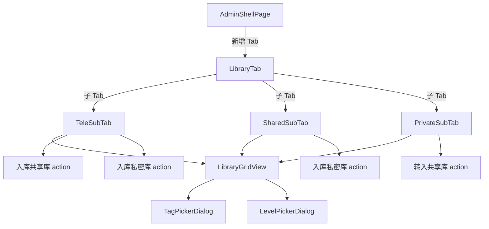

# 技术设计：管理端三库管理

Feature Name: admin-library-management
Updated: 2026-09-10

## 描述

在 PicWall Android 管理端新增「素材库」Tab，包含 Telegram 文件库、共享库、私密库三个子视图，支持库区间转存、快速标签、分级、时间排序和网格/列表视图切换。对齐 Web admin 端（admin.html）的素材库功能。

## 架构



## 组件与接口

### 1. 数据模型：`PoolItem`（新增）

对应 `random_pool` 表条目，供共享库和私密库共用。

```dart
class PoolItem {
  final int id;
  final String url;
  final String thumbUrl;
  final String title;
  final String tags;
  final String fileType;
  final int? width;
  final int? height;
  final int? fileSize;
  final String source;       // manual / tg / upload / postimages
  final int? tgFileId;
  final int enabled;
  final String createdAt;
  final String level;        // pt / vip / svip / vvip
  final int isPrivate;       // 0=共享, 1=私密
  final int? folderId;

  static PoolItem fromJson(Map<String, dynamic> r);
}
```

### 2. 数据模型：`AdminFileRecord`（已存在）

已存在于 `admin_file.dart`，对应 `files` 表条目，供 Telegram 库使用。字段包含 `id`, `url`, `fileName`, `fileType`, `fileSize`, `tags`, `level`, `poolState`, `createdAt`。

### 3. 仓库层方法（新增到 `gallery_repository.dart`）

| 方法 | API | 说明 |
|------|-----|------|
| `adminPoolList(adminKey, {keyword, tags, level, isPrivate, orderBy, limit, offset})` | `GET /admin/api/pool` | 共享库/私密库列表 |
| `adminPoolBatch(adminKey, {ids, level, enabled, isPrivate})` | `POST /admin/api/pool/batch` | 批量更新级别/启用/库区 |
| `adminPoolTags(adminKey, {ids, tags, mode})` | `POST /admin/api/pool/tags` | 批量打标 |
| `adminPoolBatchDelete(adminKey, {ids})` | `POST /admin/api/pool/batch-delete` | 批量删除 |
| `adminPoolFromTg(adminKey, {ids, tags, level})` | `POST /admin/api/pool/from-tg` | TG → 共享库 |
| `adminPrivatePoolFromTg(adminKey, {ids, tags})` | `POST /admin/api/private-pool/from-tg` | TG → 私密库 |
| `adminFilesList(adminKey, {page, pageSize, keyword, type, state})` | `GET /admin/api/files` | Telegram 文件列表 |
| `adminFilesTags(adminKey, {ids, tags, mode})` | `POST /admin/api/files/tags` | TG 文件打标 |
| `adminTagsList(adminKey)` | `GET /admin/api/tags` | 预设标签库 |

### 4. UI 组件

#### 4.1 `LibraryTab`（新增）

管理页第 5 个 Tab，内部用 `SegmentedButton` 切换三个子视图：

| 子 Tab | 数据源 | 操作 |
|--------|--------|------|
| Telegram | `GET /admin/api/files` | 入库共享库、入库私密库、打标签 |
| 共享库 | `GET /admin/api/pool?is_private=0` | 转入私密库、打标签、分级、删除 |
| 私密库 | `GET /admin/api/private-pool` | 转入共享库、打标签、分级、删除 |

#### 4.2 `LibraryGridView`（新增）

复用 `storage_tab.dart` 的网格模式，核心结构：

```dart
class LibraryGridView extends StatelessWidget {
  final List<PoolItem> items;      // 或 List<AdminFileRecord>
  final Set<String> selected;      // 多选 key
  final bool gridMode;             // 网格/列表
  final void Function(String key) onTap;
  final void Function(String key) onLongPress;
  // ...
}
```

每个网格项显示：缩略图 + 序号 + 级别徽章 + 来源徽章。

#### 4.3 `TagPickerDialog`（新增）

弹出式标签选择面板：

1. 从 `GET /admin/api/tags` 加载预设标签库
2. 支持多选/取消
3. 确认后调用对应 tags API

#### 4.4 `LevelPickerDialog`（新增）

弹出式级别选择面板：

1. 显示 4 个级别选项（pt / vip / svip / vvip）
2. 每个级别带颜色标识
3. 确认后调用 `POST /admin/api/pool/batch`

### 5. 管理页改造（`admin_shell.dart`）

在现有 4 个 Tab 基础上新增第 5 个 Tab：

```
索引 0: StatsTab     → 统计
索引 1: ScrapeTab    → 采集
索引 2: LibraryTab   → 素材库（新增）
索引 3: TrashTab     → 回收站
索引 4: StorageTab   → 仓储
```

导航栏图标：`library_books`（素材库）。

## 数据模型

### PoolItem（新增，`lib/data/models/pool_item.dart`）

```dart
class PoolItem {
  const PoolItem({
    required this.id,
    required this.url,
    this.thumbUrl = '',
    this.title = '',
    this.tags = '',
    this.fileType = 'photo',
    this.width,
    this.height,
    this.fileSize,
    this.source = 'manual',
    this.tgFileId,
    this.enabled = 1,
    this.createdAt = '',
    this.level = 'pt',
    this.isPrivate = 0,
    this.folderId,
  });

  final int id;
  final String url;
  final String thumbUrl;
  final String title;
  final String tags;
  final String fileType;
  final int? width;
  final int? height;
  final int? fileSize;
  final String source;
  final int? tgFileId;
  final int enabled;
  final String createdAt;
  final String level;
  final int isPrivate;
  final int? folderId;

  String get displayUrl => thumbUrl.isNotEmpty ? thumbUrl : url;
  bool get isImage => fileType == 'photo' || fileType == 'image';

  static PoolItem fromJson(Map<String, dynamic> r) => PoolItem(
        id: (r['id'] as num?)?.toInt() ?? 0,
        url: (r['url'] ?? '').toString(),
        thumbUrl: (r['thumb_url'] ?? '').toString(),
        title: (r['title'] ?? '').toString(),
        tags: (r['tags'] ?? '').toString(),
        fileType: (r['file_type'] ?? 'photo').toString(),
        width: (r['width'] as num?)?.toInt(),
        height: (r['height'] as num?)?.toInt(),
        fileSize: (r['file_size'] as num?)?.toInt(),
        source: (r['source'] ?? 'manual').toString(),
        tgFileId: (r['tg_file_id'] as num?)?.toInt(),
        enabled: (r['enabled'] as num?)?.toInt() ?? 1,
        createdAt: (r['created_at'] ?? '').toString(),
        level: (r['level'] ?? 'pt').toString(),
        isPrivate: (r['is_private'] as num?)?.toInt() ?? 0,
        folderId: (r['folder_id'] as num?)?.toInt(),
      );
}
```

## 正确性约束

1. **库区互斥**：`is_private` 只能为 0 或 1，切换时必须原子更新。
2. **私密库级别**：从共享库转入私密库时，级别自动降为 `svip`；从 TG 入库私密库时固定 `vvip`。
3. **去重**：TG → pool 入库时，服务端以 `tg_file_id` 去重，客户端需处理 `duplicated` 计数。
4. **分页一致性**：无限滚动加载时，新数据追加到列表末尾，不重复加载。

## 错误处理

| 场景 | 处理策略 |
|------|---------|
| 网络请求失败 | SnackBar 显示错误信息，保留当前列表状态 |
| 入库重复 | 显示「已存在 N 条，跳过」提示 |
| 标签/分级 API 失败 | 显示错误信息，保留选中状态 |
| 列表加载失败 | 显示重试按钮 |

## 测试策略

1. **单元测试**：`PoolItem.fromJson` 往返测试
2. **集成测试**：仓库层 API 方法 mock 测试
3. **CI 验证**：`flutter analyze` + `flutter test`（push main 触发）

## 参考

- [^1]: admin.html — Web admin 端三库 UI（panel-pool / panel-private / panel-files）
- [^2]: src/events.js — pool/tags、pool/batch、pool/from-tg handler
- [^3]: src/public.js — pool list、private-pool list handler
- [^4]: android/picwall_app/lib/features/admin/admin_shell.dart — 管理页 Tab 结构
- [^5]: android/picwall_app/lib/features/admin/storage_tab.dart — 网格视图参考实现
- [^6]: android/picwall_app/lib/data/models/admin_file.dart — AdminFileRecord 模型
