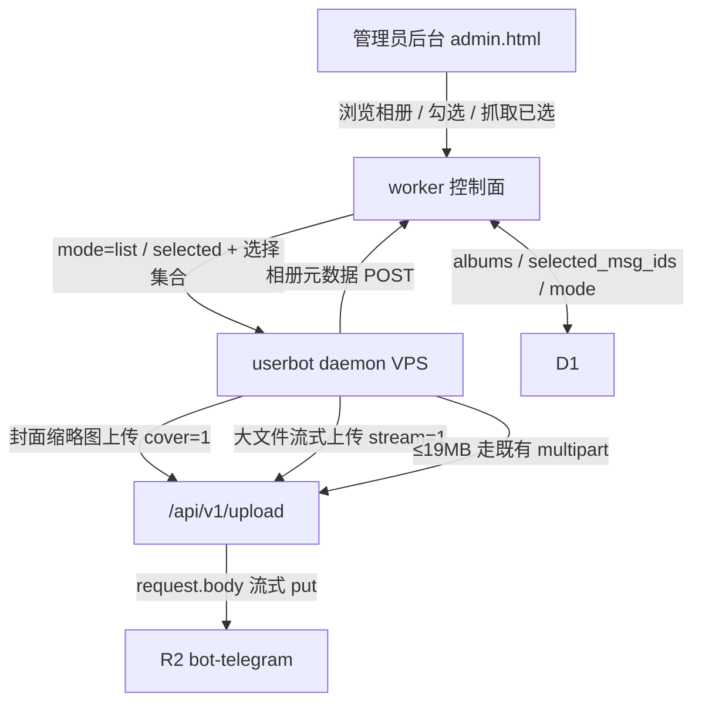

# 群抓取相册管理 + 大文件流式上传

Feature Name: album-crawl-and-large-upload
Updated: 2026-09-01

## Description

在现有群抓取链路（`scripts/userbot_pull.py` 常驻 + worker 控制面）上新增三项能力：

1. **相册列表浏览**：管理员在后台对某任务发起「浏览相册」，worker 将任务 `mode` 置为 `list`，userbot 下一轮以列表模式枚举最近 N 条消息（默认 2000，按任务可配），按 `grouped_id` 聚合相册，仅上报元数据 + 上传封面缩略图，随后自动回到普通模式。
2. **页面勾选抓取**：管理员在后台浏览相册缓存并勾选，选择的消息 id 集合持久化到任务；触发「抓取已选」后任务进入 `selected` 一次性模式，userbot 仅下载所选消息媒体入库，完成后自动清空选择并恢复普通模式。
3. **大文件流式上传**：`/api/v1/upload` 增加流式分支：`Content-Length > 19MB` 时直接以 `request.body` 流式写入 R2（不整块读入 worker 内存），硬上限 **90MB**；userbot 下载到的大文件（>19MB ≤90MB）走该路径入库，>90MB 跳过。

## Architecture



## Components and Interfaces

### 1. 数据模型（`src/db.js`）

`userbot_tasks` 新增列（SCHEMA_VERSION 5→6，走 ALTER 迁移，旧库自动补列）：

| 列 | 类型/默认 | 说明 |
|---|---|---|
| `mode` | TEXT DEFAULT 'normal' | `normal` / `list` / `selected` |
| `selected_msg_ids` | TEXT DEFAULT '' | 勾选消息 id，逗号分隔，上限 5000 个 |
| `scan_limit` | INTEGER DEFAULT 2000 | 列表模式枚举消息条数上限 |

新增表 `ubot_albums`（相册缓存，任务隔离，重建时先清后插）：

```sql
CREATE TABLE IF NOT EXISTS ubot_albums (
  id INTEGER PRIMARY KEY AUTOINCREMENT,
  task_id INTEGER NOT NULL,
  grouped_id TEXT NOT NULL,
  msg_ids TEXT NOT NULL,          -- JSON 数组，消息 id 升序
  count INTEGER DEFAULT 0,        -- 张数
  sizes TEXT DEFAULT '[]',        -- JSON: [{id, size, w, h}]
  cover_url TEXT DEFAULT '',
  first_ts INTEGER DEFAULT 0,     -- 首条消息 unix 秒
  has_oversize INTEGER DEFAULT 0, -- 含 >max_size 图片
  created_at TEXT,
  UNIQUE(task_id, grouped_id)
);
CREATE INDEX IF NOT EXISTS idx_ubot_albums_task ON ubot_albums(task_id);
```

`random_pool` / `files` 表不变；大文件 `md5_hash` 留空（Web Crypto 不支持流式 MD5），依赖既有 `telegram_file_id` 去重语义。

### 2. worker 接口（`src/userbot.js` + `src/public.js`）

脚本侧（`ub_token` 鉴权，复用现有 `handleUserbotTaskConfig` 鉴权逻辑）：

| 接口 | 方法 | 说明 |
|---|---|---|
| `/api/ubot/task/{id}/config` | GET | 响应新增 `task.mode`、`task.selected_msg_ids`、`task.scan_limit`；全局新增 `upload_hard_max`(90MB) |
| `/api/ubot/task/{id}/albums` | POST | 批量上报相册；body `{albums:[{grouped_id,msg_ids,count,sizes,cover_url,first_ts,has_oversize}]}`；先删该任务旧缓存再插入；完成后 `mode` 置回 `normal` |

管理侧（`API_KEY` 鉴权）：

| 接口 | 方法 | 说明 |
|---|---|---|
| `/admin/api/userbot-tasks/{id}` | PATCH | 扩展接受 `mode`/`selected_msg_ids`/`scan_limit`；`max_size` clamp 上限 100MB→**90MB** |
| `/admin/api/userbot-tasks/{id}/albums/list` | POST | 置 `mode='list'`（可带 `scan_limit`），触发下一轮枚举 |
| `/admin/api/userbot-tasks/{id}/albums` | GET | 返回该任务 `ubot_albums` 全量 |
| `/admin/api/userbot-tasks/{id}/albums/select` | POST | body `{msg_ids:[...]}` 覆盖写 `selected_msg_ids`（校验属于该任务相册缓存） |
| `/admin/api/userbot-tasks/{id}/albums/trigger` | POST | 校验选择非空后置 `mode='selected'`；空则 400 拒绝 |

上传（`src/public.js` `handlePublicUpload`）新增两个查询参数分支，返回结构不变：

| 参数 | 行为 |
|---|---|
| `cover=1` | body 为 multipart 小图（封面 ≤19MB 走既有路径），R2 key `album_covers/{task_id}/{grouped_id}.{ext}`，**不写 files/random_pool 行**，返回 `{ok,data:{url}}` |
| `stream=1` | body 为原始字节流；读取 `Content-Length` 与 `X-File-Name`/`Content-Type` 头；>90MB 返回 413；直接 `R2_BUCKET.put(key, request.body, {httpMetadata})`，`md5_hash=''`，写 files 行（file_type 由扩展名推导），返回与既有一致 |

流式分支常量：`PUBLIC_UPLOAD_HARD_MAX = 90 * 1024 * 1024`。`putR2` 复用既有实现，仅 key 拼装与 body 来源不同。

### 3. 脚本（`scripts/userbot_pull.py`）

新增常量与分支，复用现有 `TelegramClient` 会话：

```
UPLOAD_HARD_MAX = 90 * 1024 * 1024   # 与 worker 一致；>19MB 走 stream 上传
```

- **`run_list_albums`（mode=list）**：`client.iter_messages(chat, limit=scan_limit)` 枚举，按 `msg.grouped_id` 聚合；每相册取首条消息 `download_media(thumb=0)` 得小图 → 以 `cover=1` 上传得 `cover_url`（失败留空不阻断）；相册 sizes 取 `msg.media.photo.sizes` 中非缩略的最大 `size`；`has_oversize = any(size > task.max_size)`；最后 `POST /api/ubot/task/{id}/albums` 整批上报。
- **`run_selected_pull`（mode=selected）**：解析 `selected_msg_ids` → `await client.get_messages(chat, ids=ids)` 逐条处理；尺寸判定 → `download_media(file=bytes)` → 上传：`len≤19MB` 走既有 `files=` multipart，`19MB<len≤90MB` 走 `stream=1` 原始字节 POST（`httpx content=`，VPS 内存可承受）；沿用既有 `done/skipped/min_id` 断点回写与 `run-report` 上报。中途失败保留选择，下轮重试；全部完成靠 `run-report(finished)` 触发 worker 清选择。
- **`run_pull`（普通模式）**：除上传超限阈值由 `max_size`（≤90MB）决定并接入 `stream=1` 分支外，行为不变。

### 4. 一次性语义收尾（`src/servers.js`）

`handleRunReport` 中：`status=='finished'` 且任务 `mode=='selected'` → `UPDATE userbot_tasks SET mode='normal', selected_msg_ids='', updated_at=?`。`mode=='list'` 的收尾由 albums POST 完成；`error` 状态不清选择。

### 5. 管理后台（`admin.html`）

群抓取任务行新增按钮组：

- **「相册」**：`POST /albums/list` → 轮询 `GET /albums`（2s/次，至多 60s）→ 弹窗网格：封面图 + 张数 + 首条时间 + 「超限」红标 + 复选框。
- **「保存选择」**：收集勾选相册的 `msg_ids` → `POST /albums/select`。
- **「抓取已选」**：`POST /albums/trigger`；成功提示「已下发，将在下一轮抓取所选相册」。
- 弹窗内显示「扫描上限」输入（默认 2000）与「重新扫描」按钮（`POST /albums/list` 重建缓存）。

## Data Models

- `userbot_tasks.mode`：三态字符串；`list` 为瞬时态（本轮枚举完成即回 `normal`），`selected` 为一次性态（本轮抓取完成即回 `normal`）。
- `userbot_tasks.selected_msg_ids`：逗号分隔消息 id，属「已勾选待抓」的中间态；与 `last_id` 断点正交——selected 模式按 id 集合处理，不推进/不依赖 `last_id` 顺序语义。
- `ubot_albums`：纯缓存，可重建；不承担状态职责。

## Correctness Properties

1. `list` / `selected` 模式互斥且最终必回 `normal`（albums POST 或 run-report finished 收敛）。
2. 选择集合为空时 `trigger` 必返回 400。
3. 大文件上传硬上限 worker 与脚本一致（90MB）；超过则脚本跳过并计入 `skipped`，worker 413 兜底。
4. `max_size` 任务级 clamp 上限收紧到 90MB，杜绝任务配置越过流式硬上限。
5. 普通模式（≤19MB multipart、`last_id` 断点）路径零改动，回归兼容。

## Error Handling

| 场景 | 处理 |
|---|---|
| 列表模式枚举中断（FloodWait/网络） | 保留已聚合结果，超时兜底直接上报已收集相册；`mode` 由 albums POST 收敛回 `normal` |
| 封面缩略图下载/上传失败 | `cover_url=''`，相册仍上报，前端显示占位图 |
| selected 模式中途失败 | 不清选择；下轮循环自动重试剩余（已入库消息可能重复上传，属可接受边缘：手动一次性场景，靠既有 telegram_file_id 去重兜底） |
| 大文件上传 413/超时 | 计入 `skipped`；429/5xx 按既有 sleep 重试策略 |
| 相册元数据上报过大（大群） | 单次 POST 上限 500 相册；超出分片多次 POST（幂等：先删后插，最后一次落定） |
| `Content-Length` 缺失 | 回退：流式分支要求脚本必带 `Content-Length`（httpx bytes 天然携带）；缺失则 411 |

## Test Strategy

1. **单元（worker 本地）**：`wrangler dev` 下用 `curl` 验证——`cover=1` 不落 files 行且 R2 有对象；`stream=1` 19MB~90MB 流式入库；>90MB 返回 413；≤19MB 走既有路径。
2. **脚本 dry 验证**：`--dry-run` 模式打印 selected 模式命中消息清单；列表模式打印聚合相册统计（张数/超限标记）。
3. **端到端**：VPS 跑 `ubot.sh` 一键部署后，后台对测试群任务走「浏览相册 → 勾选 → 保存 → 抓取已选」，核对：D1 `ubot_albums` 有数据、files 表仅新增所选相册图片、任务 `mode` 回 `normal`、选择已清空。
4. **回归**：普通模式任务照常跑一轮，`last_id` 断点与上传行为与改造前一致。

## References

[^1]: (src/userbot.js#L107-128) - 任务配置接口（扩展 mode/selected_msg_ids/scan_limit/upload_hard_max）
[^2]: (src/public.js#L908-981) - `handlePublicUpload`（新增 cover/stream 分支与硬上限）
[^3]: (src/servers.js#L324-360) - `handleRunReport`（selected 模式 finished 收尾清选择）
[^4]: (scripts/userbot_pull.py#L218-320) - `run_pull`（复用下载/上传骨架，抽出 album/selected 分支）
[^5]: (src/db.js#L61) - `userbot_tasks` 表结构（迁移新增三列 + ubot_albums 表）
