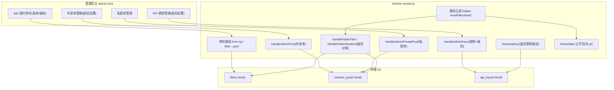

# 内容分级与私密库

Feature Name: content-tier-access
Updated: 2026-08-29

## Description

在现有 Telegram R2 Bot Worker 基础上引入内容分级体系:

1. **内容分级**: `files` 与 `random_pool` 表新增 `level` 字段(枚举 `pt/vip/svip/vvip`,默认 `pt`,向下兼容存量数据)。「随机库」更名为「共享库」。
2. **密钥分级与级别对等**: `api_keys` 表新增 `level` 字段,公开 API(`/api/v1/*`)按请求密钥级别过滤输出,只返回级别不大于密钥级别的内容,避免低价格密钥获取高价格内容。
3. **私密库**: 新增私密内容集合(级别等同 `vvip`),私密内容不得进入共享库,仅 `vvip` 密钥可访问。tele 图片可加入私密库。

## Architecture



## Components and Interfaces

### 1. 数据模型变更

`files` 表新增列:

- `level TEXT DEFAULT 'pt'` —— 内容级别,枚举 `pt/vip/svip/vvip`。
- `is_private INTEGER DEFAULT 0` —— 私密标记,1 表示属于私密库。

`random_pool` 表新增列:

- `level TEXT DEFAULT 'pt'` —— 共享库内容级别。
- `is_private INTEGER DEFAULT 0` —— 私密标记,1 表示属于私密库,不参与共享库随机/公开输出。

`api_keys` 表新增列:

- `level TEXT DEFAULT 'pt'` —— 密钥级别,默认 `pt`。

D1 变更采用安全迁移:在 `ensureTablesOnce` 中按列存在性执行 `ALTER TABLE ADD COLUMN`(SQLite/D1 支持 `PRAGMA table_info` 检测),避免全表重建。

### 2. 级别对等过滤 helper

```js
// worker.js 新增
const LEVEL_RANK = { pt: 0, vip: 1, svip: 2, vvip: 3 };

// 根据访问方级别生成 SQL 过滤子句与参数
function levelFilter(keyLevel) {
  const rank = LEVEL_RANK[keyLevel] ?? 0;
  const allowed = Object.keys(LEVEL_RANK).filter(k => LEVEL_RANK[k] <= rank);
  // 返回 { sql: 'AND level IN (?,?,...)', params: allowed }
}
```

调用点统一通过 `levelFilter(k?.rec?.level)` 获取过滤子句,追加到现有 `WHERE` 链,保证过滤在 SQL 层完成。

### 3. 公开访问入口的级别对等

| 入口 | 访问方级别 | 行为 |
|------|-----------|------|
| `/api/v1/files` | 密钥级别(匿名=pt) | 只返回 `level <= 密钥级别` 且 `is_private=0` 的内容 |
| `/api/v1/random` | 密钥级别(匿名=pt) | 只从 `random_pool` 选 `level <= 密钥级别` 且 `is_private=0` 的记录 |
| `/show/data` | 匿名(视为 pt) | 只返回 `level='pt'` 且 `is_private=0` 的内容 |
| 节目单 `/api/show-data` 等拉图 | 内部(视为 pt) | 同上,只取 `level <= pt` 即 `level='pt'` |

`checkApiKey` 返回 `{ rec, limited }` 中 `rec.level` 即密钥级别;匿名请求按 `pt` 处理。

### 4. 管理后台接口

- `GET/POST /admin/api/pool`(共享库):列表/新增/编辑,编辑支持 `level` 字段;列表展示 `level` 与 `is_private`。
- 新增 `GET/POST /admin/api/private-pool`(私密库):独立的列表与新增入口,写入 `is_private=1`;私密库图片不进入共享库筛选。
- `POST /admin/api/files/to-pool` 及 tele 转存流程:支持指定 `level` 与 `is_private`。
- `GET/POST /admin/api/keys`:新增 `level` 字段读写,列表展示密钥级别。

### 5. 转存与共享库入库

- tele 图片转存至 `files` 时记录 `level`(默认 pt,管理员可指定)。
- 从 `files` 导入共享库时继承 `files.level`。
- 标记 `is_private=1` 的 tele 图片只进入私密库,`random_pool` 写入 `is_private=1`,任何共享库/公开查询(`enabled=1 AND is_private=0`)均不可见。

## Data Models

```sql
-- files 新增列
ALTER TABLE files ADD COLUMN level TEXT DEFAULT 'pt';
ALTER TABLE files ADD COLUMN is_private INTEGER DEFAULT 0;

-- random_pool 新增列
ALTER TABLE random_pool ADD COLUMN level TEXT DEFAULT 'pt';
ALTER TABLE random_pool ADD COLUMN is_private INTEGER DEFAULT 0;

-- api_keys 新增列
ALTER TABLE api_keys ADD COLUMN level TEXT DEFAULT 'pt';
```

枚举校验约束:

- `level` 取值 `{'pt','vip','svip','vvip'}`,写入前用 `LEVEL_RANK` 校验,非法值回落 `pt`。
- `is_private=1` 的内容在访问侧视为级别 `vvip`,即使 `level` 字段较低也仅 `vvip` 密钥可见。

## Correctness Properties

1. **存量兼容**: 未显式设置级别的旧内容/密钥默认 `pt`,升级后原公开内容对匿名与 `pt` 密钥仍可见。
2. **级别对等**: 请求方密钥级别为 `L` 时,任何输出内容级别必须 `<= L`。
3. **私密封闭**: `is_private=1` 的内容不出现在共享库、公开 API 输出、公开页 `/show` 及节目单拉图中。
4. **私密最高级**: 私密内容仅 `vvip` 密钥可访问,`level` 字段较低的密钥一律不可见。
5. **过滤在 SQL 层**: 所有公开查询在数据库查询阶段完成级别过滤,不拉取超范围数据到 Worker 内存。
6. **名称一致性**: 管理后台所有「随机库」文案替换为「共享库」,但 API 路径与数据库表名保持 `random_pool` 不变,避免破坏既有调用。

## Error Handling

| 场景 | 处理 |
|------|------|
| `ALTER TABLE ADD COLUMN` 重复执行 | 通过 `PRAGMA table_info` 检测列存在性后跳过,幂等 |
| 非法 `level` 值写入 | 校验失败回落默认 `pt`,接口返回 `ok:false` 与错误说明 |
| 匿名访问公开 API | 按 `pt` 过滤,无需报错 |
| 私密内容被低级别密钥请求命中 | 静默排除,不返回 403(避免枚举探测),只在结果为空时返回 404 `No file matches`(沿用现有行为) |

## Test Strategy

- **单元测试**: `levelFilter` 对四种密钥级别输出正确的 SQL 子句与参数;`LEVEL_RANK` 非法值回退。
- **接口验证**(通过 CI 部署后 curl):
  - `pt` 密钥请求 `/api/v1/files` 不含 vip/svip/vvip 内容,不含 `is_private=1`。
  - `vvip` 密钥可获取全部级别与私密内容;匿名仅 `pt` 且非私密。
  - 私密图片不出现在 `/show/data` 与 `/api/v1/random` 响应中。
- **迁移验证**: 在已有数据上执行 `ensureTablesOnce`,确认旧行 `level='pt'`、`is_private=0`,表结构与预期一致。

## References

[^1]: (worker.js#L159) - 公开 API 路由 `/api/v1/files` `/api/v1/random`
[^2]: (worker.js#L3184) - `checkApiKey` 密钥校验
[^3]: (worker.js#L3238) - 公开内容查询(show/data 复用)
[^4]: (worker.js#L3260) - `handlePublicRandom` 随机抽图
[^5]: (src/db.js#L17) - `files` 表结构
[^6]: (src/db.js#L30) - `api_keys` 表结构
[^7]: (src/db.js#L31) - `random_pool` 表结构
[^8]: (worker.js#L3462) - 共享库新增图片写入
