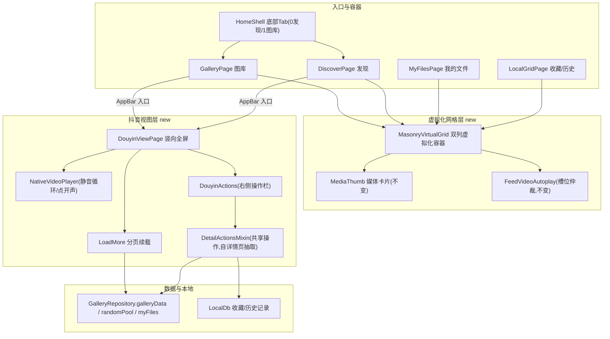

# 抖音视图与列表懒加载

Feature Name: douyin-view-and-lazy-load
Updated: 2026-09-09

## Description

PicWall Android 客户端的两项浏览体验升级：

1. **列表懒加载**：将图库 / 发现 / 我的文件 / 本地库（收藏、历史）四类列表的「`SingleChildScrollView + Wrap` 一次性构建全部条目」改造为「双列按行分组的虚拟化滚动容器」，仅构建视口与缓存带内的行；缩略图在卡片真正构建时才开始请求，配合 `CachedNetworkImage` 缓存避免重复下载。分页、下拉刷新、空态/错误态、`FeedVideoAutoplay` 槽位仲裁均保持原有行为。

2. **抖音视图**：图库、发现两个页面 AppBar 提供入口，以竖向全屏 PageView（一屏一媒体）浏览当前列表（沿用列表过滤条件）；图片 contain 完整展示，视频默认静音自动循环、点击画面切换声音；右侧常驻操作图标栏（收藏 / 保存 / 分享 / 详情 / 下载视频）；滑动近尾部自动加载更多。

实现全部位于 `android/picwall_app`，不新增后端接口、不改存储结构。依赖既有能力：`NativeVideoPlayer`（含软解回退）、`FeedVideoAutoplay`（槽位仲裁）、`DetailPage` 的操作逻辑（收藏/保存/分享/详情，抽取为共享混入）、`PagedMedia` 分页封装、`CachedNetworkImage`。

## Architecture



### 架构说明

- **懒加载网格是纯展示层改造**：分页状态（`_items/_page/_total/_loading*`）继续留在各页面 State；`MasonryVirtualGrid` 只负责把内存中已加载条目按行分组虚拟化渲染，并向外部暴露“构建每一行的两列 cell 内容”的能力。
- **抖音视图复用一套数据流**：入口传入“当前列表已加载 items + 起始翻页游标 + 续载 loader 闭包 + 当前过滤上下文”，内部 `DouyinViewPage` 自己维护滑动列表并在近尾部触发 loader 追加。
- **操作逻辑抽混入**：从 `DetailPage` 抽出的 `DetailActionsMixin`（ConsumerState 混入）承载 历史记录/收藏态读写/收藏切换/保存图片/下载视频/分享/详情底部面板/直链补全；`DetailPage` 与 `DouyinViewPage` 共用，保证抖音视图行为与详情页一致。

## Components and Interfaces

### 1. 虚拟化网格：`MasonryVirtualGrid`（新文件 `lib/features/gallery/masonry_virtual_grid.dart`）

双列瀑布流虚拟化容器。替代四处的 `SingleChildScrollView + LayoutBuilder + Wrap`。

```dart
class MasonryVirtualGrid extends StatelessWidget {
  const MasonryVirtualGrid({
    super.key,
    required this.itemCount,
    required this.buildCell,        // Widget Function(BuildContext ctx, int index, double cellWidth)
    required this.cellAspect,       // double Function(int index)  每格宽高比(用于行高预排)
    this.controller,                // ScrollController (外部传入, 供分页/feed 监听)
    this.padding = 10,
    this.spacing = 10,
    this.cacheExtent = 300,
    this.footer,                    // 底部加载指示等额外行(整个容器宽)
  });
}
```

设计要点：

- 内部用 `SliverGrid`（`CustomScrollView` + `SliverGrid`）无法保持瀑布流不等高；改用 **自定义双列分行**：`CustomScrollView` + `SliverList`，每个 child 是一行 `Row`（两列 `SizedBox(width: cellWidth)` 各放一张卡；最后一行若奇数则补一列占位）。行高由两格中较高者决定，`MasonryVirtualGrid` 通过 `cellAspect(index)` 计算预估行高用于 `SliverList` 的滚动范围稳定（避免加载滚动条跳变）。
- 网格 cell 宽度沿用现有公式：`cellWidth = (constraints.maxWidth - 30) / 2`，间距 10，保持视觉与现有 Wrap 一致。
- `cacheExtent` 默认 300：仅构建视口上下各 300px 内的行；因此缩略图 `CachedNetworkImage` 只在卡片临近视口时发起请求。滚动速度较快时可能出现短暂灰色占位，卡片占位层已有 `surfaceContainerHighest` 底色，直接复用。
- `MediaThumb` 内部布局（AspectRatio 撑高、播放角标、等级/私密 badge）与自动播放注册完全不变，仅替换外层滚动容器。

#### 现有列表页接入方式（页面自身保留分页状态）

| 页面 | 数据源 | 分页 | 改造内容 |
|---|---|---|---|
| `GalleryPage`/`PagedMediaGrid`（图库） | `galleryData(limit 60, offset)` | `_page` 递增 | 把 `_body()` 中 Wrap 换成 `MasonryVirtualGrid`；`_items`、`_loadFirst/_loadMore/_onScroll` 不变 |
| `DiscoverPage`（发现） | `randomPool(count 10)` | 一次性换一批 | Wrap 换成 `MasonryVirtualGrid`；`_loadRandom` 不变 |
| `MyFilesPage`（我的文件） | `myFiles(pageSize 30)` | `_page` 递增 | Wrap 换成 `MasonryVirtualGrid`；长按删除/打标逻辑不变 |
| `LocalGridPage`（收藏/历史） | `LocalDb.listFavorites/listHistory` | 无(一次性) | Wrap 换成 `MasonryVirtualGrid`；移除/清空逻辑不变 |

- `PagedMediaGrid` 中 `MediaThumb` 的 `autoplayIndex` 传 `_items` 真实下标（行分组不改变 index 语义）；`_feed.onScroll` 监听继续挂在外部传入的 `controller`。
- `DiscoverPage`/`MyFilesPage`/`LocalGridPage` 同样保留 `_feed` 槽位注册与 `FeedGate` 可见性门控。

### 2. 共享操作混入：`DetailActionsMixin`（新文件 `lib/features/detail/detail_actions.dart`）

把 `DetailPage` 中当前内联的以下逻辑抽取为 `ConsumerState` 混入，使 `DetailPage` 与 `DouyinViewPage` 共用：

| 方法 | 来源(DetailPage) | 行为 |
|---|---|---|
| `_syncBrowse(item)` | `_syncItem` | 写入浏览历史(幂等) + 读收藏态 |
| `_readFav(item)` / `_toggleFavorite(item)` | `_toggleFavorite` | LocalDb.favorite/unfavorite + dedupeKey |
| `_savePhoto(item)` | `_save` | dio 下载原图 → Gal 相册(权限引导/提示一致) |
| `_downloadVideo(item)` | `_downloadVideo` | dio 下载视频字节 → Gal.putImageBytes |
| `_shareItem(item)` | `_share` | SharePlus 分享绝对直链 |
| `_showInfo(item)` | `_showDetail` | 详情底部面板(文件名/类型/尺寸/大小/来源/时间/等级/标签/复制直链) |
| `_abs(base, u)` / `_fmtSize(bytes)` | 顶层私有函数 | 直链补全 / 尺寸格式化 |

混入签名（示意）：

```dart
mixin DetailActionsMixin on ConsumerState {
  String get apiBase; // 由宿主提供: ref.read(settings).apiBase
  void showSnack(String msg); // 宿主提供 SnackBar 封装
  // 其余方法以 item 为参数, 内部用 ref 访问 LocalDb/api/providers
}
```

`DetailPage` 改为混入后删除重复私有方法（页面行为不变）；`DouyinViewPage` 混入同一能力。注意：`_showDetail` 原实现中标签点击为“pop 两层面板+跳转标签搜索(TODO)”，抽取时保留为宿主可配置回调，抖音视图默认仅复制直链/展示详情，不实现跳转。

### 3. 抖音视图：`DouyinViewPage`（新文件 `lib/features/douyin/douyin_view_page.dart`）

```dart
class DouyinViewPage extends ConsumerStatefulWidget {
  const DouyinViewPage({
    super.key,
    required this.initialItems,
    required this.loadPage,     // Future<PagedMedia> Function(GalleryRepository repo, int page)
    required this.startPage,    // 已加载到的页码(进入后从 startPage+1 起续载)
    required this.title,
  });
}
```

- **滑动主体**：竖向 `PageView.builder`，一屏一媒体；`_currentIndex` 驱动“当前屏才渲染视频播放器，邻屏显示 `_VideoPoster` 封面占位”。`active` 语义与 `DetailPage._MediaViewer` 一致，视频用 `NativeVideoPlayer(url, poster, autoplay:true, loop:true, muted:…, controls:false, fit:contain, softwareFallback:true)`。
- **加载更多**：`onPageChanged` 中判断 `index >= items.length - 3` 时调用 `widget.loadPage(repo, ++_page)`，追加到列表；到尾(`PagedMedia.total`)或接口返回空停止，并显示“没有更多了”底部提示（追加一条空态 View）。
- **数据入口构造（图库）**：`GalleryPage` AppBar 新增抖音入口按钮，进入时把当前过滤上下文（`_type/_level/_appliedTag/_oldestFirst`）与 `galleryData` loader 封装为 `loadPage` 闭包传入。沿用现有 `_gridKey` 语义保证切换过滤后进入的列表正确。
- **数据入口构造（发现）**：`DiscoverPage` AppBar 新增抖音入口按钮，传 `randomPool(count:10,type:_type)` 当前批作为 initialItems；`loadPage` 用 `randomPool` 续批（因 random 无页码语义，追加时按 `dedupeKey` 去重，去重后新增为 0 视为到底）。
- **图片展示**：contain 的 `Image.network`（absolute url）+ 深色渐变信息层（标题/序号/等级角标），不缩放不裁切；图片无声音，点击不触发声音切换。

### 4. NativeVideoPlayer 声音支持（修改 `lib/features/video/native_video_player.dart`）

抖音视图“点击画面开声”需要外部驱动静音状态。当前 `_toggleMute` 是内部方法、控件内置在控制层。增加能力：

- 新增可选参数 `showTapToUnmute = false`：为 true 时，当 `controls:false` 且当前静音，整画面叠加一个透明手势层，点击调用内部 `_toggleMute()` 开声；再次点击画面切回静音。图标（音量）随状态浮层提示。
- 或暴露外部开关：新增 `bool mutedExternally` 通过 didUpdateWidget 同步到 `_muted`。**实现采用前者（画面点击自持），避免父级重建**；与既有 `_VideoPoster` 邻屏占位解耦。
- `SoftwareVideo` 软解回退路径同样透传 `muted`（其已接收 `muted` 参数）。

### 5. 入口与路由

- 图库/发现两页 AppBar actions 加 `IconButton`（图标 `Icons.swipe_vertical`，tooltip “抖音视图”），仅当列表有内容时可用。
- 进入 `DouyinViewPage` 使用 `Navigator.push`（全屏黑底 route），返回即 pop 回原列表页，滚动位置自然保留（列表 State 未被销毁）。
- 抖音视图内视频自动播放不受 `FeedVideoAutoplay` 管理（独立全屏页自持播放），返回列表时列表页 `_feed` 因路由重新可见自动恢复（既有 FeedGate 行为）。

## Data Models

不新增数据模型。依赖既有：

- `MediaItem`：`dedupeKey`(收藏/历史去重)、`displayThumb`、`isPhoto/isVideo`、`width/height`(AspectRatio 撑高)、`level/tags/isPrivate`(角标)。
- `PagedMedia`：`items/total/offset/hasMore`，供 `loadPage` 续载判断与“没有更多”提示。
- `LocalDb`：`record/favorite/unfavorite/isFavorited` 保持原契约。

抖音视图追加 items 时统一按 `dedupeKey` 去重，防止 random 批次与续批重复。

## Correctness Properties

1. 懒加载改造后，四类列表**可见内容与滚动行为不变**：cell 宽度公式、间距、瀑布流视觉、下拉刷新触发、分页触底阈值(距底 400px)保持与现状一致。
2. 网格视频自动播放槽位按**原 items 下标**注册；虚拟化导致离屏行销毁时，`MediaThumb.dispose → unregisterVideo` 自动摘槽，feed 仲裁不受影响（这是既有机制）。
3. 抖音视图仅**当前屏**初始化视频解码器；切页销毁旧页并释放资源，避免多播放器并发。
4. 抖音视图进入时沿用调用方列表过滤条件；数据源对象为进入瞬间快照（`List.of`），避免列表页后续刷新反向影响。
5. 收藏态/历史记录写入路径与详情页一致，抖音视图内操作结果与详情页看到的状态一致（同 LocalDb、同 dedupeKey）。
6. 尾部分页判定：图库按 `total` 兜底；发现按去重后新增 0 条兜底，均有终止条件，防止无限请求。
7. `DetailActionsMixin` 抽取后 `DetailPage` 行为等价（回归面最小化：先重构 detail 引用再新增抖音视图复用）。

## Error Handling

| 场景 | 处理 |
|---|---|
| 抖音视图首屏加载失败/空列表 | 入口按钮禁用；若进入后首屏网络失败，展示全屏错误 + 重试按钮（复用 `AppErrorState` 样式） |
| 图片加载失败 | `Image.network` errorBuilder → broken_image 占位，不阻断滑动 |
| 视频加载失败 | NativeVideoPlayer 错误界面 + 软解回退按钮 + 复制链接，行为与详情页一致 |
| 保存/下载失败 | SnackBar 文案与 DetailPage 一致（“需要相册权限”“保存失败：请检查网络”等），收藏失败回滚乐观状态 |
| 分页续载失败 | 停止追加、`_loadingMore=false`；尾部再滑动时允许重试（沿用 PagedMediaGrid 对 _loadMore 失败的静默处理） |
| 虚拟化快速滚动闪白 | 卡片占位灰底承接，无布局错位 |

## Test Strategy

本地无 flutter 工具链，Dart 改动由 CI（`.github/workflows/build-android.yml`：`flutter create` 脚手架 + 编译 debug APK）验证类型与编译；`android/picwall_app/test/` 已有纯 Dart 测试（widget_test/media_item_test 等），新增测试只做纯逻辑断言：

1. **懒加载辅助纯函数单测**：行分组/奇数尾行补位/预估行高计算函数（`test/` 新增，若函数抽为纯逻辑）。验证：`itemCount=0/1/2/5` 分组正确、cell 宽不变、尾行不拉伸。
2. **行数裁剪与 cacheExtent 语义**：验证 `MasonryVirtualGrid` 的 `itemCount` 到行数换算与 footer 追加行。
3. **去重纯函数单测**：抖音视图续批按 dedupeKey 合并去重逻辑。
4. **回归清单（人工 + CI 编译）**：四类列表首屏/无限滚动/下拉刷新/长按删除打标；视频网格自动播放；详情页操作(收藏/保存/分享/详情面板/复制)重构后等价；抖音视图进入(图库带过滤、发现带类型)、切页播放、开声、保存收藏分享、返回列表位置保持、上滑续载到末尾。
5. `flutter analyze`（若 CI 纳入）确保无 lint 告警；改动仅限 `android/picwall_app/**`，不触发 Worker 部署。

## References

[^1]: (android/picwall_app/lib/features/gallery/paged_media_grid.dart) - 图库分页网格容器（Wrap 一次性构建，改造对象）
[^2]: (android/picwall_app/lib/features/gallery/gallery_page.dart) - 图库页(过滤器+入口宿主)
[^3]: (android/picwall_app/lib/features/discover/discover_page.dart) - 发现页(randomPool 宿主+入口)
[^4]: (android/picwall_app/lib/features/my/my_files_page.dart) - 我的文件(分页网格宿主)
[^5]: (android/picwall_app/lib/features/library/local_grid_page.dart) - 收藏/历史网格宿主
[^6]: (android/picwall_app/lib/features/gallery/media_thumb.dart) - 媒体卡片(自动播放槽位, 不变)
[^7]: (android/picwall_app/lib/features/video/native_video_player.dart) - 播放器(需加点击开声能力)
[^8]: (android/picwall_app/lib/features/detail/detail_page.dart) - 详情页(抽取 DetailActionsMixin 来源)
[^9]: (android/picwall_app/lib/data/repositories/gallery_repository.dart) - galleryData/randomPool/myFiles 分页
[^10]: (android/picwall_app/lib/features/video/feed_video_autoplay.dart) - 网格视频自动播放仲裁(不变)
[^11]: (android/picwall_app/lib/data/models/media_item.dart) - MediaItem/dedupeKey/displayThumb
