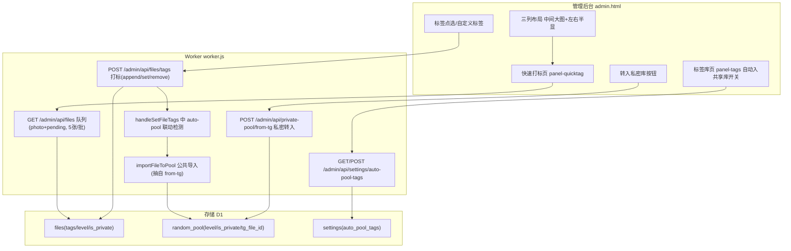

# Tele 库快速打标与标签自动入共享库

Feature Name: quick-tagging
Updated: 2026-08-29

## Description

管理后台新增 **快速打标页面**:以「中间大图 + 左右半显预览」的三列布局逐张处理 tele 库中未入库的图片,点选标签即打标,一键转入私密库;同时在标签管理页为每个标签提供「自动入共享库」开关,文件被打上命中标签后自动进入共享库。全部能力复用现有 `files` / `random_pool` 表与标签接口,不引入新表,仅新增一个设置项。

## Architecture



## Components and Interfaces

### 1. 快速打标队列接口

复用 `GET /admin/api/files`,固定参数:

```
GET /admin/api/files?pool_state=pending&state=completed&page_size=5&page=N
```

- `pool_state=pending` 复用现有过滤:未进入 `random_pool`(含私密)且未被忽略的文件,天然排除已入共享库/私密库的文件。
- `page_size=5` 每批 5 条,对应「中间 + 左右各 2」窗口;不限定类型,图片/视频/文档/音频均可入列。
- 响应项经 `decorateLinks` 注入 `display_url`;快标页对 photo 直接用图,视频用 `thumb_url` 或播放占位,文档/音频用类型图标。

### 2. 打标接口与自动入共享库联动

现有 `POST /admin/api/files/tags`(`handleSetFileTags`)是全部打标途径(快标/批量/编辑)的统一服务端入口。在此处追加 auto-pool 联动,使规则在所有途径生效:

```
Body: { ids, tags: [...], mode: 'set'|'append'|'remove' }
```

联动算法:

1. 读取 `auto_pool_tags` 设置(缓存 30s)。
2. 对每个 `id`,计算本次**实际新增**标签:
   - `set`: 新标签集合(视为新增)。
   - `append`: `tags - 原有tags`。
   - `remove`: 空(不触发)。
3. 若实际新增标签与 `auto_pool_tags` 有交集,调用 `importFileToPool(f)`。
4. `importFileToPool` 先检查 `random_pool` 是否已存在 `tg_file_id` 对应记录,存在则跳过(避免重复,也避免把已入私密的文件二次导入共享库)。

### 3. 公共导入函数

从现有 `handleAdminPoolFromTg` / `handleAdminPrivatePoolFromTg` 中抽出公共 INSERT:

```js
// f: files 行; opts: { level(默认继承 f.level), isPrivate(默认 0) }
async function importFileToPool(f, opts, env) {
  const ex = await env.D1_DB.prepare('SELECT id FROM random_pool WHERE tg_file_id = ?').bind(f.id).first();
  if (ex) return false;
  const level = (opts && opts.level) || sanitizeLevel(f.level);
  const isPrivate = (opts && opts.isPrivate) ? 1 : 0;
  await env.D1_DB.prepare('INSERT INTO random_pool (url, thumb_url, title, tags, level, is_private, file_type, width, height, file_size, source, tg_file_id, enabled, created_at) VALUES (?, ?, ?, ?, ?, ?, ?, ?, ?, ?, \'tg\', ?, 1, ?)')
    .bind(f.r2_url, f.thumb_url || f.r2_url, f.file_name || '', f.tags || '', level, isPrivate, f.file_type || 'photo', f.width || null, f.height || null, f.file_size || null, f.id, new Date().toISOString()).run();
  return true;
}
```

既有 `handleAdminPoolFromTg` / `handleAdminPrivatePoolFromTg` 改用该函数,行为不变。

### 4. 自动入共享库标签设置

`settings` 表新增键 `auto_pool_tags`(JSON 字符串数组),接口:

- `GET /admin/api/settings/auto-pool-tags` → `{ ok, data: { tags: [...] } }`
- `POST /admin/api/settings/auto-pool-tags` body `{ tags: [...] }` → 覆盖保存

### 5. 快速打标页面(前端)

- 导航新增 tab「快速打标」,对应 `panel-quicktag`。
- 三列布局:容器 `quick-tag-grid`,`grid-template-columns: 1fr 1.6fr 1fr`;左右列各含上下两个半显位(容器高度 50% + `overflow:hidden`,`img { object-fit:cover }`),中间为当前文件主预览。
- 位置映射:左侧上/下 = 队列中当前文件前第 2/1 个,右侧上/下 = 后第 1/2 个。
- 非图片类型展示:photo 用 `display_url` 大图;video 有 `thumb_url` 用缩略图否则播放占位;文档/音频用类型图标,保证半显位布局一致。
- 底部标签区:
  - 「已有标签」chips(当前图 tags,点击 = 移除)。
  - 「候选标签」chips(预设标签 + 本次会话新打的自定义标签 + 高频历史标签,点击 = append)。
  - 自定义标签输入框 + 「添加」按钮:append 后写入候选列表,供后续图复用。
- 操作栏:「已打标·下一张」/「跳过」/「上一张」/「转入私密库」。
- 队列管理:本地数组 `qtQueue`;当前图处理完移除,`qtQueue` 不足 2 张时拉取下一页;私密转入成功后调用 `from-tg` 并从队列移除。
- 打标请求统一走 `POST /admin/api/files/tags { ids:[cur.id], tags:[t], mode:'append' }`,服务端 auto-pool 联动自动转入共享库的图会从后续队列刷新中消失。

### 6. 标签库页自动入共享库开关

- `panel-tags` 的「全部已用标签」列表(`tagsAllList`)每项渲染开关:开启状态读 `auto_pool_tags`。
- 开关切换时更新本地数组并 `POST /admin/api/settings/auto-pool-tags` 覆盖保存。

## Data Models

无新表。变更仅:

```sql
-- settings 表新增键(运行时写入,无需迁移)
INSERT OR REPLACE INTO settings (key, value) VALUES ('auto_pool_tags', '["风景","人物"]');
```

依赖既有字段:

- `files.tags TEXT` —— 逗号分隔标签。
- `files.level TEXT DEFAULT 'pt'` —— 自动入共享库时继承。
- `files.is_private INTEGER` —— 不因自动入共享库而改变。
- `random_pool.tg_file_id INTEGER` —— 导入去重键。
- `random_pool.is_private INTEGER` —— 私密转入时写 1,自动入共享库写 0。

## Correctness Properties

1. **队列封闭**: 快速打标队列只含 `pool_state=pending` 的 completed 文件,已入共享库/私密库的一律不出现。
2. **触发一致性**: 自动入共享库仅在「实际新增标签命中」时触发,已有该标签的文件重打标不重复触发。
3. **重复免疫**: `importFileToPool` 以 `tg_file_id` 去重,重复调用不产生重复行。
4. **私密封闭**: 已在私密库(`random_pool` 存在记录)的文件不因 auto-pool 而二次进入共享库。
5. **级别继承**: 自动入共享库写入 `random_pool.level = files.level`,不改变文件自身级别。
6. **私密最高级**: 快标页「转入私密库」沿用现有 `from-tg` 语义,写入 `level='vvip', is_private=1`。

## Error Handling

| 场景 | 处理 |
|------|------|
| 打标接口网络失败 | 前端提示错误,当前图保留在队列,不推进 |
| 私密转入失败 | 前端提示错误,当前图保留在队列,不推进 |
| `auto_pool_tags` JSON 非法/缺失 | 按空数组处理,不触发联动 |
| `importFileToPool` 插入失败 | 打标接口整体返回 `ok:false`,不静默吞错 |
| 队列翻页到空 | 显示「暂无待处理图片」空态 |

## Test Strategy

- **单元验证**(部署后 curl):
  - `POST /admin/api/settings/auto-pool-tags` 保存 `["风景"]`,`GET` 回读一致。
  - 给无标签文件 `append` 标签 `风景` → 文件自动出现在 `random_pool`(`source='tg'`,级别=文件级别);重复 append → 不产生新行。
  - 关闭开关后同操作 → 不产生 `random_pool` 行。
  - 已入私密的文件 append 命中标签 → 不产生第二条 `random_pool` 记录。
- **前端手动验证**:
  - 快标页三列布局稳定,前 2/后 2 半显正确,边界(不足 2 张)占位正常。
  - 点预设/历史/自定义标签 → 当前图 tags 追加并高亮;点已有标签 → 移除。
  - 自定义标签进入候选列表且后续图可复用。
  - 「转入私密库」→ 图进入私密库并从队列消失;「已打标·下一张」推进。
- **回归**: 现有文件列表批量打标/标签编辑行为不变;`/admin/api/pool/from-tg`、`/admin/api/private-pool/from-tg` 保持原语义。

## References

[^1]: (admin.html#L376) - 文件管理面板与工具栏
[^2]: (admin.html#L2702) - 标签库页全部已用标签列表
[^3]: (worker.js#L3343) - `handleSetFileTags` 打标接口
[^4]: (worker.js#L3322) - `handleAdminTags` 标签计数
[^5]: (worker.js#L3968) - `handleAdminPoolFromTg` 共享库导入
[^6]: (worker.js#L4027) - `handleAdminPrivatePoolFromTg` 私密库导入
[^7]: (worker.js#L2481) - `handleFiles` 文件列表(队列来源)
[^8]: (worker.js#L3586) - `handleAdminPrivatePoolList` 私密库列表
